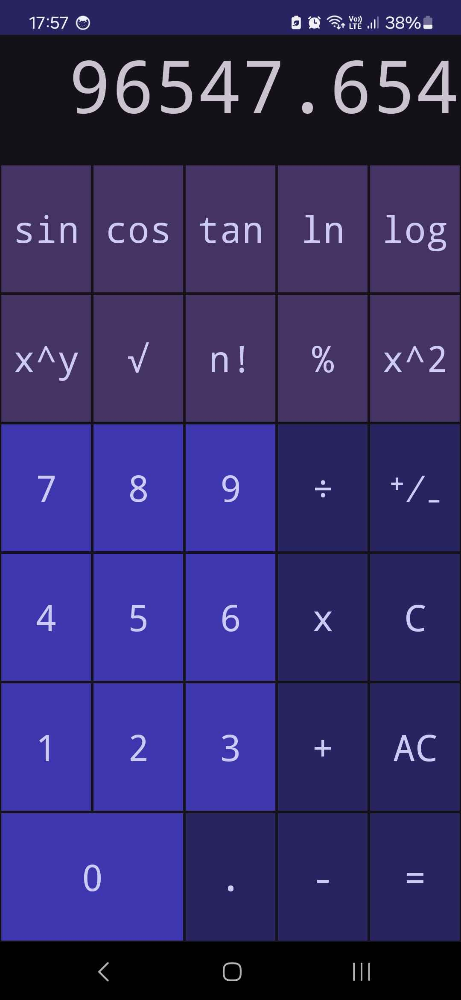

# Mobile Calculator

 

     

Android calculator app with simple and scientific mode.

## Features

- Simple mode calculator.
- Scientific mode calculator.

## Release

`
v1.0
`

## Technologies

- Android SDK 34
- JVM 1.8
- Gradle 8.2.2
- Kotlin 1.9.22

## Preview

     

